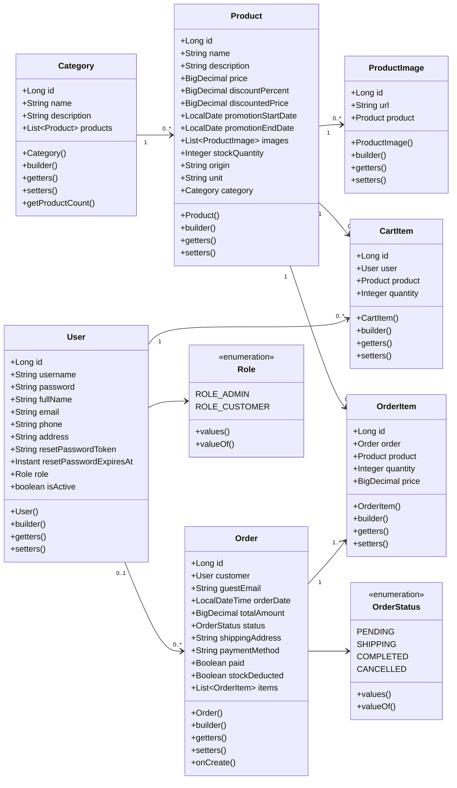

# Biểu đồ lớp hệ thống Clean Food

Biểu đồ dưới đây chỉ liệt kê các lớp chính, thuộc tính và phương thức của hệ thống.

```mermaid
classDiagram
    direction LR

    class User {
        +Long id
        +String username
        +String password
        +String fullName
        +String email
        +String phone
        +String address
        +String resetPasswordToken
        +Instant resetPasswordExpiresAt
        +Role role
        +boolean isActive
        +User()
        +builder()
        +getters()
        +setters()
    }

    class Category {
        +Long id
        +String name
        +String description
        +List~Product~ products
        +Category()
        +builder()
        +getters()
        +setters()
        +getProductCount()
    }

    class Product {
        +Long id
        +String name
        +String description
        +BigDecimal price
        +BigDecimal discountPercent
        +BigDecimal discountedPrice
        +LocalDate promotionStartDate
        +LocalDate promotionEndDate
        +List~ProductImage~ images
        +Integer stockQuantity
        +String origin
        +String unit
        +Category category
        +Product()
        +builder()
        +getters()
        +setters()
    }

    class ProductImage {
        +Long id
        +String url
        +Product product
        +ProductImage()
        +builder()
        +getters()
        +setters()
    }

    class CartItem {
        +Long id
        +User user
        +Product product
        +Integer quantity
        +CartItem()
        +builder()
        +getters()
        +setters()
    }

    class Order {
        +Long id
        +User customer
        +String guestEmail
        +LocalDateTime orderDate
        +BigDecimal totalAmount
        +OrderStatus status
        +String shippingAddress
        +String paymentMethod
        +Boolean paid
        +Boolean stockDeducted
        +List~OrderItem~ items
        +Order()
        +builder()
        +getters()
        +setters()
        +onCreate()
    }

    class OrderItem {
        +Long id
        +Order order
        +Product product
        +Integer quantity
        +BigDecimal price
        +OrderItem()
        +builder()
        +getters()
        +setters()
    }

    class Role {
        <<enumeration>>
        ROLE_ADMIN
        ROLE_CUSTOMER
        +values()
        +valueOf()
    }

    class OrderStatus {
        <<enumeration>>
        PENDING
        SHIPPING
        COMPLETED
        CANCELLED
        +values()
        +valueOf()
    }

    User "1" --> "0..*" CartItem
    Product "1" --> "0..*" CartItem
    Category "1" --> "0..*" Product
    Product "1" --> "0..*" ProductImage
    User "0..1" --> "0..*" Order
    Order "1" --> "1..*" OrderItem
    Product "1" --> "0..*" OrderItem
    User --> Role
    Order --> OrderStatus
```
